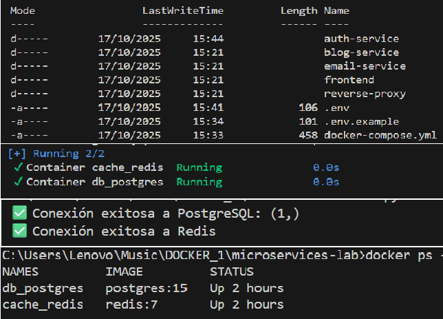

# Laboratorio de Microservicios (Django + React)

## Arquitectura inicial
- [auth-service/](./microservices-lab/auth-service)   → Autenticación y tokens JWT
- [blog-service/](./microservices-lab/blog-service)   → Publicaciones, autores y categorías
- [email-service/](./microservices-lab/email-service)   → Notificaciones y formularios
- [frontend/](./microservices-lab/frontend)   → Interfaz React
- [reverse-proxy/](./microservices-lab/reverse-proxy)   → Balanceo / Gateway local
- [.env.example](./microservices-lab/.env.example)   → Variables de entorno de ejemplo
- [docker-compose.yml](./microservices-lab/docker-compose.yml)   → Orquestador de contenedores base
- [requirements.txt](./microservices-lab/requirements.txt)   → Dependencias del proyecto

Servicios base:
- PostgreSQL (5432) → Base de datos principal
- Redis (6379)  → Sistema de caché y mensajería

### 1️⃣ Levantar los contenedores
```bash
docker compose up -d
docker ps

### 2️⃣ Instalar las dependencias
```bash
pip install -r requirements.txt

### 3️⃣ Probar conexión
python auth-service/test_connection.py

## 📸 Evidencia de contenedores en ejecución



